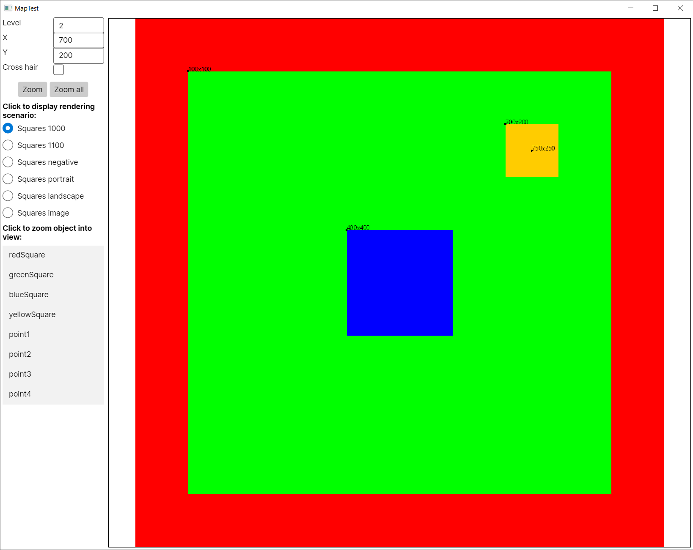

# Codenizer.Avalonia.Map

An Avalonia UI control to build zoomable and pannable maps.

## Usage

Reference the Codenizer.Avalonia.Map NuGet package in your project.

Add the necessary namespace to the AXAML file you want to include the control on:

```xml
<Window xmlns="https://github.com/avaloniaui"
        xmlns:x="http://schemas.microsoft.com/winfx/2006/xaml"
        xmlns:d="http://schemas.microsoft.com/expression/blend/2008"
        xmlns:mc="http://schemas.openxmlformats.org/markup-compatibility/2006"
        xmlns:map="clr-namespace:Codenizer.Avalonia.Map;assembly=Codenizer.Avalonia.Map" <!-- Add this -->
```

Add the control:

```xml
<map:Map
            VerticalAlignment="Stretch"
            HorizontalAlignment="Stretch"
            Name="TestMap"
            MapObjectSelected="Map_OnMapObjectSelected"/>
```

Then from code add objects to the map in order for them to be rendered:

```csharp
TestMap.MapObjects.Add(new Square("redSquare", 0, 0, 1000, 1000, "#FF0000"));
TestMap.MapObjects.Add(new Square("greenSquare", 100, 100, 800, 800, "#00FF00"));
TestMap.MapObjects.Add(new Square("blueSquare", 400, 400, 200, 200, "#0000FF"));
TestMap.MapObjects.Add(new Square("yellowSquare", 700, 200, 100, 100, "#FFCC00"));

TestMap.MapObjects.Add(new Point("point1", 100, 100, 2, "#000000"));
TestMap.MapObjects.Add(new Point("point2", 400, 400, 2, "#000000"));
TestMap.MapObjects.Add(new Point("point3", 700, 200, 2, "#000000"));
TestMap.MapObjects.Add(new Point("point4", 750, 250, 2, "#000000"));
```

And observe the result: 

For more details have a look at the MapTest sample application.

## Features

The control supports zooming and panning. These are controlled mainly through methods on the control itself, for example:

- `ZoomAll` which ensures all objects added to the control will be visible
- `ZoomExtent` which fits the provided object into the viewport (with some padding for extra niceness)
- `Zoom` which supports zooming to an arbitrary level and center position

Additionally, mouse-wheel zoom is supported directly by the control. Panning is handled through a drag action on the control.

The control provides a `MapObjectSelected` event which will fire after clicking on a _selectable_ (see below) object. It will only fire if an object was under the cursor.

## Adding objects to the control

The control supports these object types out of the box:

- Square
- Path
- Point
- Image

Custom objects can be created by inheriting from `MapObject` that provides the following properties and methods:

- `Name` this is the identifier used by `ZoomExtent`
- `Bounds` the outer bounds of the object
- `IsSelectable`, a flag that indicates whether this object can be selected through clicking on it
- `IsVisible`, a flag that indicates whether this object should be rendered
- `Contains(position)`, returns `true` when the given position is within the bounds of this object. Useful if you have a complex shape.
- `TightContains(position)`, allows for a more specific hit test on the position. Useful if you have a complex shape.
